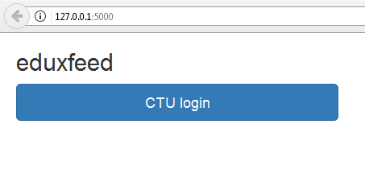
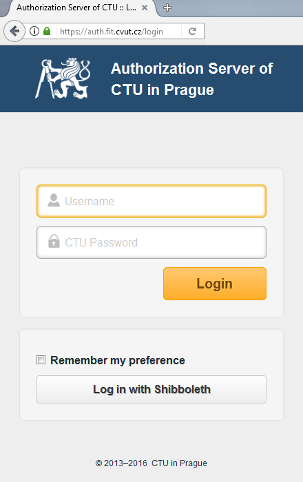
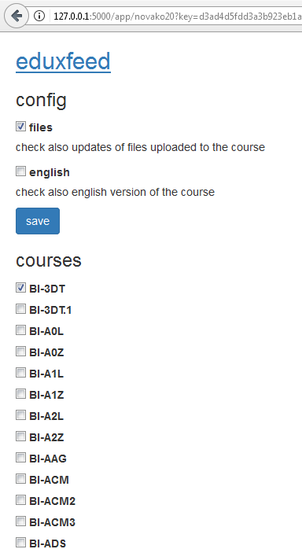

Introduction
============

**eduxfeed** is a web application for checking `EDUX`_, written in `Python 3`_.

| You get a stream of updates for all the `FIT CTU`_ courses of your interest.
| It uses `CTU OAuth`_ for you to log in and `CTU API`_ to get your enrolled courses.
| You can change your settings and subscribe to other courses as well.

Sounds interesting? OK, then head over to :doc:`install`!

*This project is licensed under the terms of* `MIT License`_.

.. _EDUX: https://edux.fit.cvut.cz
.. _Python 3: https://docs.python.org/3.5/
.. _FIT CTU: https://www.fit.cvut.cz/en
.. _CTU API: https://auth.fit.cvut.cz/manager
.. _CTU OAuth: https://auth.fit.cvut.cz/login.html
.. _MIT License: https://opensource.org/licenses/MIT

App logic
---------

The app needs authorized access to `EDUX`_, therefore to you must provide your own CTU credentials for the app to work. This is required only on the backend, to be able to check EDUX for new content and perform database updates. Users of the web app don't need to do this, they just authenticate and authorize the app using `CTU OAuth`_.

Updates are to be run regularly and independently of the web application. The web app just serves as an interface for changing settings and reading feeds. The update (function) checks EDUX for changes and updates feeds of all users according with respect to user settings. The feed items are stored locally in a file and only get read and transformed into a feed when user checks the feed.

When user reads an item of a feed (clicks the feed item link), it gets registered in the app, processed as item marked-as-read, and the respective feed gets updated (item removed or changed). After this processing, user is redirected to the EDUX page containing the change (either diff page or actual page, or a file).

As for security, access to feeds is restricted, users must provide their unique key (in url query). The feed link which includes the key is at the very top of the settings page, this page is displayed right after the login. In case the feed is accessed without the key, a feed item informing about auth error is displayed, so the user can log in and get the right link again. Links of feed items (which actually transform the feed after clicking) are secured via hash, using a user secret token (created upon register). This means the hash can't be forged and the app knows it's coming from it when processing such item.

Screenshots
-----------

Login

OAuth redirect

Settings

Feed

.. image:: ../_static/app_feed.png
